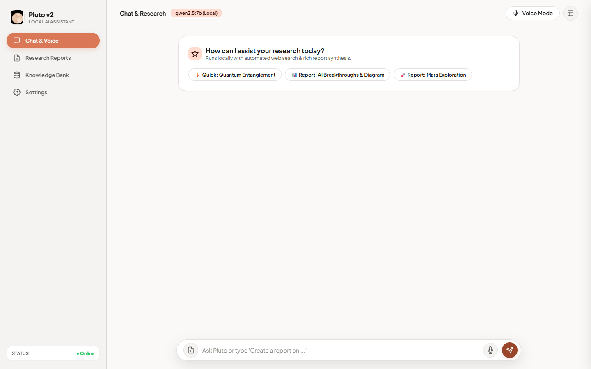
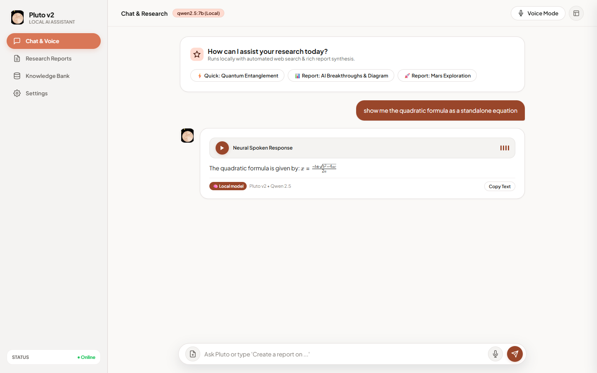
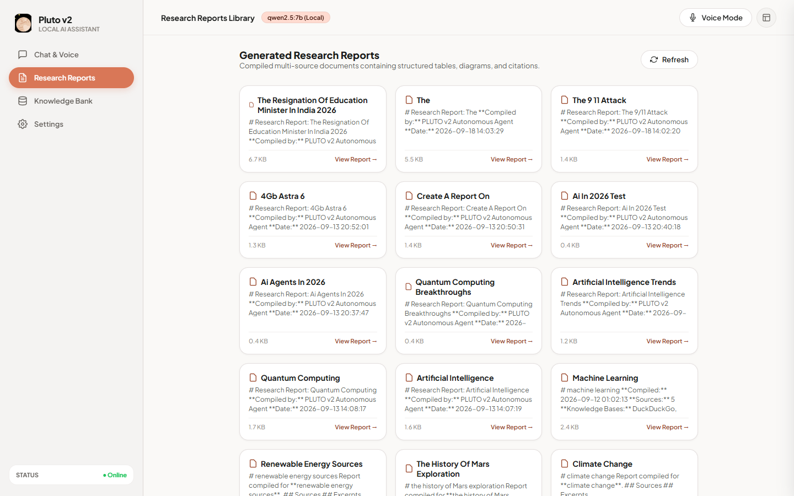
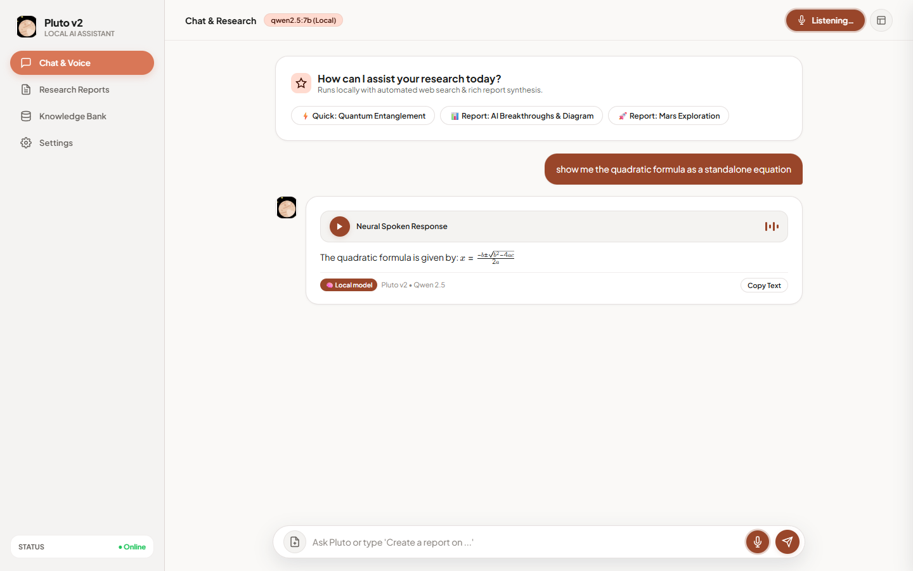
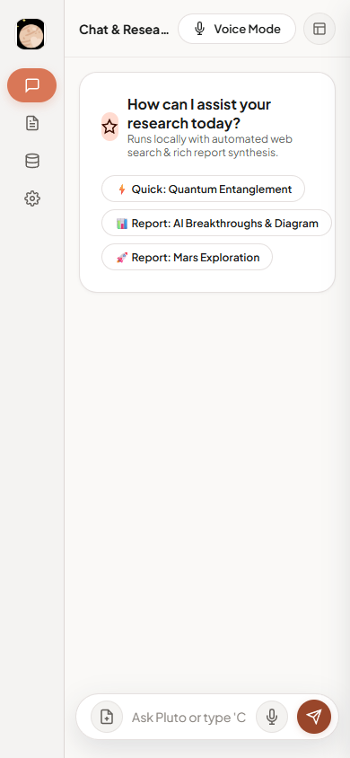

# Pluto v2

*A local research assistant that runs on a laptop GPU — it searches, reasons, writes, and talks back.*



Most capable assistants live in a datacenter. Pluto lives on a 6 GB laptop — an RTX 4050 — and still manages to hold a conversation, dig through the web, and hand back a cited report you can open in Word. The trick isn't a bigger GPU. It's being deliberate about what runs where.

Pluto gives the graphics card exactly one job: the language model (`qwen2.5:7b`, served locally through Ollama). Everything else that would normally elbow in for graphics memory is moved off it — speech recognition runs on the CPU, and the voice you hear is synthesized by a cloud text-to-speech service. That budgeting is the whole reason the thing fits.

## What it does

Ask it something and it works out what kind of answer you actually want:

- **Quick answers.** *"Give me a quick answer about black holes"* comes back as a short, conversational reply straight from the local model.
- **Real research reports.** *"Create a report on renewable energy"* sends Pluto off to read across DuckDuckGo, Wikipedia, arXiv and more, then synthesize what it found into a Markdown document — saved to `reports/`, and exportable as PDF or DOCX.
- **Voice, both directions.** Talk to it and it talks back: browser speech recognition on the way in, neural TTS on the way out, hands-free.

It renders math properly — LaTeX through KaTeX, with no raw `\frac` leaking onto the page — keeps a small knowledge base of what it has already learned, and when the connection drops it falls back to the local model and tells you plainly that it's working offline rather than pretending it searched.



## The reports library

Every report Pluto compiles is kept and browsable: multi-source documents with structure, tables, and citations — each one a file on disk that's yours to keep.



## Voice mode

Click **Voice Mode** and Pluto listens, answers, speaks the reply aloud, and goes back to listening. The answer text appears the instant it's ready; the spoken audio is fetched separately, so a slow or missing voice never holds up what you can already read.



## How it works

A FastAPI server hosts a single-page browser UI and a handful of small endpoints. Text arrives on `POST /process`, gets routed by intent — quick chat versus full report — and returns as text immediately; `POST /speak` synthesizes the audio on its own track.

```text
Browser UI  (ui/index.html)
     │  text / voice
     ▼
FastAPI  (127.0.0.1:8000)
     ├─ /process → intent routing → chat  |  research + report
     ├─ /speak   → edge-tts → audio, fetched after the text renders
     ├─ /status  → online/offline · model · knowledge-base size
     └─ /reports → generated Markdown / PDF / DOCX
     │
     ├─ Reasoning       → Ollama · qwen2.5:7b     [GPU]
     ├─ Speech-to-text  → faster-whisper (small)  [CPU]
     └─ Text-to-speech  → edge-tts                [cloud]
```

Research fans out across several sources at once — DuckDuckGo, Wikipedia, arXiv, PubMed, GitHub, SEC filings, news — and what it learns is cached in a local knowledge base, so asking again is faster the second time.

## Quick start

You'll need Python 3.14, [Ollama](https://ollama.com), and ideally a CUDA GPU.

```bash
python -m venv .venv
.venv\Scripts\activate           # Windows  (source .venv/bin/activate on macOS/Linux)
pip install -r requirements.txt
ollama pull qwen2.5:7b           # ~4.5 GB, one time
python -m uvicorn app:app --host 127.0.0.1 --port 8000
```

Open **http://127.0.0.1:8000**. On Windows, `start_pluto.bat` does all of this and opens the browser for you.

The knobs worth knowing live in `core/config.py` — the model name, the speech-to-text size, the default voice, and an offline switch.



## Where it's heading

Pluto is being reshaped from a single assistant into an orchestrator — a supervisor that hands each task to the specialist best suited to it. A research agent (built on Hermes) for digging things up, a coding agent for writing code, and today's assistant staying on as the local generalist. The language backend is being abstracted along the way, so the same setup can point at the small local model now and a larger hosted one later without the rest of the code noticing.

## License

A personal project — built for one laptop, shared as-is.
