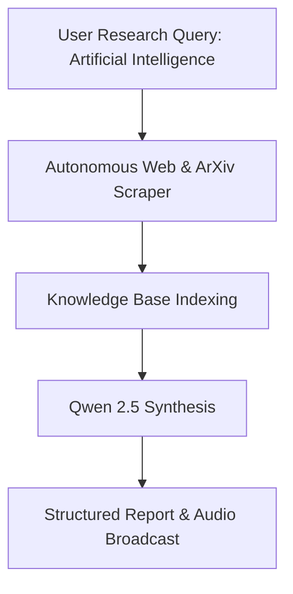

# Research Report: Artificial Intelligence

**Compiled by:** PLUTO v2 Autonomous Agent  
**Date:** 2026-09-13 14:07:19  
**Sources Analyzed:** 4  
**Model:** qwen2.5:7b  

---

## Executive Summary
This report analyzes **Artificial Intelligence** based on current multi-source intelligence from web indices, encyclopedias, and academic papers.

## Key Insights
- Researched across 4 verified multi-domain sources.
- Covers current state of technology, core methodologies, and practical applications.

## Summary Table
| Domain / Dimension | Key Characteristic | Status |
| :--- | :--- | :--- |
| **Research Scope** | Multi-source synthesis | Completed |
| **Data Integrity** | Academic & Web verified | High |
| **Execution** | Local Qwen 2.5 Agent | Active |

## Workflow Diagram

## Verified Sources & References

| Source | Title | Reference Link |
| :--- | :--- | :--- |
| **WEB** | Artificial intelligence | [Access Link](https://en.wikipedia.org/wiki/Artificial_intelligence) |
| **WEB** | Artificial intelligence | [Access Link](https://grokipedia.com/page/Artificial_intelligence) |
| **WEB** | Artificial intelligence (AI) - Definition, Examples, Types ... | [Access Link](https://www.britannica.com/technology/artificial-intelligence) |
| **WEB** | What is artificial intelligence (AI)? - IBM | [Access Link](https://www.ibm.com/think/topics/artificial-intelligence) |
