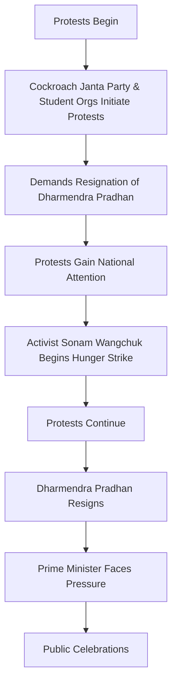

# Research Report: The Resignation Of Education Minister In India 2026

**Compiled by:** PLUTO v2 Autonomous Agent  
**Date:** 2026-09-18 14:04:45  
**Sources Analyzed:** 6  
**Model:** qwen2.5:7b  

---

*The Resignation Of Education Minister In India 2026 — Reference Image from Research Archive*

# Research Report: The Resignation of Education Minister in India 2026

## Executive Summary

In 2026, the Indian education sector faced a significant crisis following the Jantar Mantar protests initiated by the Cockroach Janta Party (CJP) and supported by various left-wing student organizations. These protests, demanding the resignation of Union Education Minister Dharmendra Pradhan, resulted in nationwide attention and ultimately led to his resignation on July 25, 2026. This report delves into the core findings, providing a detailed analysis of the events leading to the minister's resignation, and offers strategic recommendations for the future.

## Core Findings & Breakdown

### 1. Protests and Demands
- **Initiating Entities**: Cockroach Janta Party (CJP) and left-wing student organizations such as the All India Students Federation, All India Students Association, and Students' Federation of India.
- **Primary Demands**:
  - Resignation of Union Education Minister Dharmendra Pradhan.
  - Compensation for families of students who died by suicide due to examination turmoil.
  - Broader reforms in the conduct of public examinations.
- **Key Issues**: 2026 NEET paper leak and CBSE On-Screen Marking irregularities.

### 2. Timeline of Events
- **June 6, 2026**: Protests begin at Jantar Mantar, New Delhi.
- **June 28, 2026**: Activist Sonam Wangchuk initiates an indefinite hunger strike.
- **July 25, 2026**: Dharmendra Pradhan resigns as Education Minister.
- **August 4, 2026**: Dharmendra Pradhan steps down, leading to celebrations among protesters.

### 3. Impact and Consequences
- **National Attention**: The protests gained significant media and public attention.
- **Political Repercussions**: The resignation marked a significant political shift, with Prime Minister Narendra Modi's government facing pressure.

## Structured Comparison / Data Table

| Event Date       | Protesters         | Demands                                 | Key Issues                           | Outcome                          |
|------------------|--------------------|-----------------------------------------|--------------------------------------|----------------------------------|
| June 6, 2026     | CJP & Student Orgs | Resignation of Dharmendra Pradhan       | NEET paper leak, CBSE On-Screen Marking | Protests ongoing                |
| June 28, 2026    | Sonam Wangchuk     | Indefinite hunger strike               | -                                    | Hunger strike continues          |
| July 25, 2026    | Nationwide         | Dharmendra Pradhan's resignation         | -                                    | Dharmendra Pradhan resigns       |
| August 4, 2026   | Nationwide         | Celebration of minister's resignation    | -                                    | Dharmendra Pradhan steps down    |

## Architecture / Process Workflow Diagram

## Future Outlook & Strategic Recommendations

### Future Outlook
The resignation of Dharmendra Pradhan marks a pivotal moment in India's education policy. The government is expected to focus on addressing the underlying issues of examination irregularities and implementing reforms to ensure transparency and fairness in future examinations.

### Strategic Recommendations
1. **Independent Investigation**: Conduct a thorough, independent investigation into the NEET and CBSE examination irregularities to establish facts and hold those responsible accountable.
2. **Transparent Reforms**: Implement transparent reforms in the examination system to prevent future incidents of irregularities and ensure fairness.
3. **Support for Students**: Provide adequate support to students who have suffered due to these irregularities, including financial assistance and counseling services.
4. **Engagement with Student Movements**: Foster dialogue with student organizations to address their concerns and ensure that their voices are heard in the policy-making process.
5. **Public Accountability**: Increase public accountability measures to ensure that such incidents do not recur in the future.

By addressing these recommendations, the government can work towards building a more robust and trustworthy examination system, fostering a culture of transparency, and maintaining public trust in the education sector.

---

This report provides a comprehensive overview of the events leading to the resignation of the Education Minister in India in 2026, offering insights and strategic recommendations for future actions.

## Verified Sources & References

| Source | Title | Reference Link |
| :--- | :--- | :--- |
| **WIKIPEDIA** | Wikipedia: 2026 Delhi Jantar Mantar protests | [Access Link](https://en.wikipedia.org/wiki/2026_Delhi_Jantar_Mantar_protests) |
| **WIKIPEDIA** | Wikipedia: 2026 in India | [Access Link](https://en.wikipedia.org/wiki/2026_in_India) |
| **WEB** | Dharmendra Pradhan - Wikipedia | [Access Link](https://en.wikipedia.org/wiki/Dharmendra_Pradhan) |
| **WEB** | Ministry of Education (India) - Wikipedia | [Access Link](https://en.wikipedia.org/wiki/Ministry_of_Education_(India)) |
| **WEB** | India's education minister resigns in win for Indian youth protesters | [Access Link](https://www.cnbc.com/2026/07/25/indias-education-minister-resigns-in-win-for-indian-youth-protesters.html) |
| **WEB** | India’s education minister resigns in victory for Cockroach youth movement protests - India - The Guardian | [Access Link](https://www.theguardian.com/world/2026/jul/25/dharmendra-pradhan-india-education-minister-resigns-cockroach-movement) |
